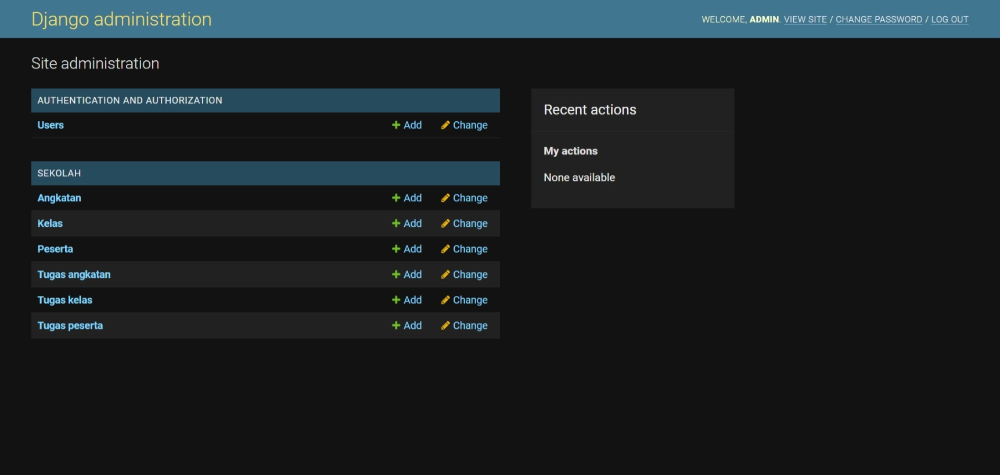

# sekolahskullers-backend

Server backend penyedia data melalui REST API untuk website Sekolah Skullers 2021.

## Prosedur instalasi

Clone repository ini.

    > git clone https://github.com/irinamrdhtllh/sekolahskullers-backend.git

Buat dan aktifkan virtual environment Python baru.

    > python -m venv .venv
    > .venv\Scripts\activate.bat

Jika berhasil maka akan muncul `(.venv)` di sebelah kiri terminal.

Install seluruh package yang diperlukan.

    (.venv) > pip install -r requirements.txt

## Penggunaan laman admin

Terdapat laman admin yang dapat digunakan untuk meninjau dan mengubah secara manual seluruh data yang tersedia. Untuk mengaksesnya diperlukan akun admin yang dapat dibuat menggunakan perintah berikut.

    (.venv) > python manage.py createsuperuser

Jalankan server

    (.venv) > python manage.py runserver

Laman admin dapat diakses pada endpoint `/admin/`

  

> **PENTING** Jangan tambahkan peserta atau kelas baru setelah terdapat tugas peserta atau tugas kelas yang telah dibuat.

## Petunjuk REST API

Berikut daftar endpoint REST API yang dapat diakses dengan mengirim request ke rute yang diinginkan dengan metode yang sesuai (GET atau POST). Untuk testing dapat menggunakan extension [REST Client](https://marketplace.visualstudio.com/items?itemName=humao.rest-client) pada Visual Studio Code. Beberapa contoh request terdapat pada file `client.http`

- `GET /api/` : Daftar seluruh endpoint
- `GET /api/students/` : List seluruh peserta
- `GET /api/groups/` : List seluruh kelas
- `GET /api/class-year/` : List angkatan
- `GET /api/profile/` : Retrieve peserta saat ini (yang sedang login)
- `GET /api/profile/group/` : Retrieve kelas saat ini

Autentikasi menggunakan JWT dengan endpoint berikut.

- `POST /api/token/register/` : Register peserta baru
- `POST /api/token/` : Login peserta
- `POST /api/token/refresh/` : Memperoleh token akses baru
- `POST /api/token/logout/` : Logout peserta

Endpoint retrieve memerlukan token di header request. Token dapat diperoleh pada saat register/login
